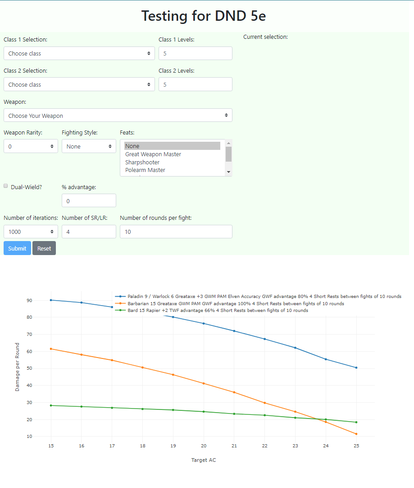

# dnd-calculator
I was discussing with a friend various strengths and weaknesses of feats and class features found in [Dungeons and Dragons 5th edition](https://www.dndbeyond.com/sources/basic-rules) classes, but did not like the "rough" estimates that we were conducting. Thus, I built a python script that will run simulations of various classes, class features, feats, weapons, etc.

# Libraries used
pandas, numpy, pyMongo, flask, random, plotly.js.
--> no longer using matplotlib

# Usage
Supports a little bit of multiclass (two classes), various weapons of rarity 0 to +3, several fighting styles and feats, Dual-Wield (assumes the same weapon in both hands), % of attacks you will expect to have advantage, and the ability to change the number of rounds per fight, number of short rests per long rest (assumes 1 fight between each short rest), and number of iterations. 

It then graphs the resulting DPR averages vs AC on a chart with any prior simulations run.

# To Do:
* <del>Replace png file with Plotly.js</del>
* Add a (non-secure) "user ID" field so multiple users can concurrently play with the calculator without interfering with each other.
* Add other features. Like unarmed monk.
* Surely there's a better way to calculate which dice should be rolled and which ones get dooubled on crits. Currently the code essentially copies itself twice to account for crits and differing dice being added (brutal critical, half orc savage, other dice get to be doubled, etc.)
* Perhaps a better way to estimate when a Paladin will use Smite and use up spell slots
* PAM GWM is broken. Not the calculator, just how much damage it can output.
